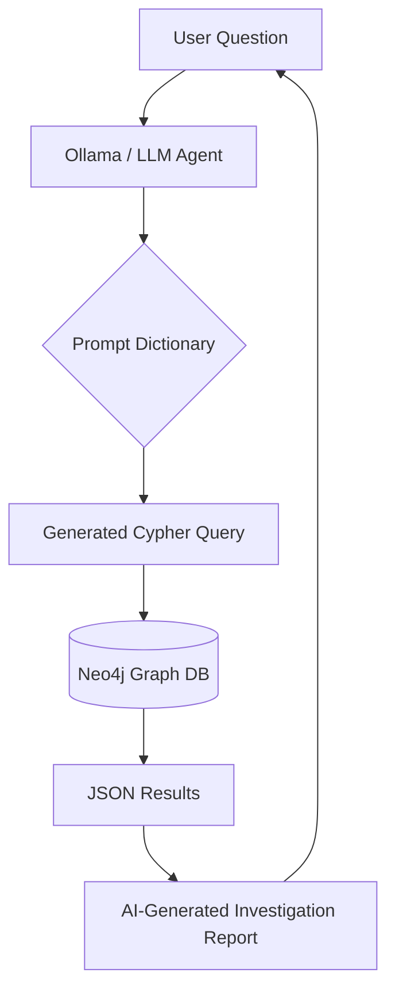
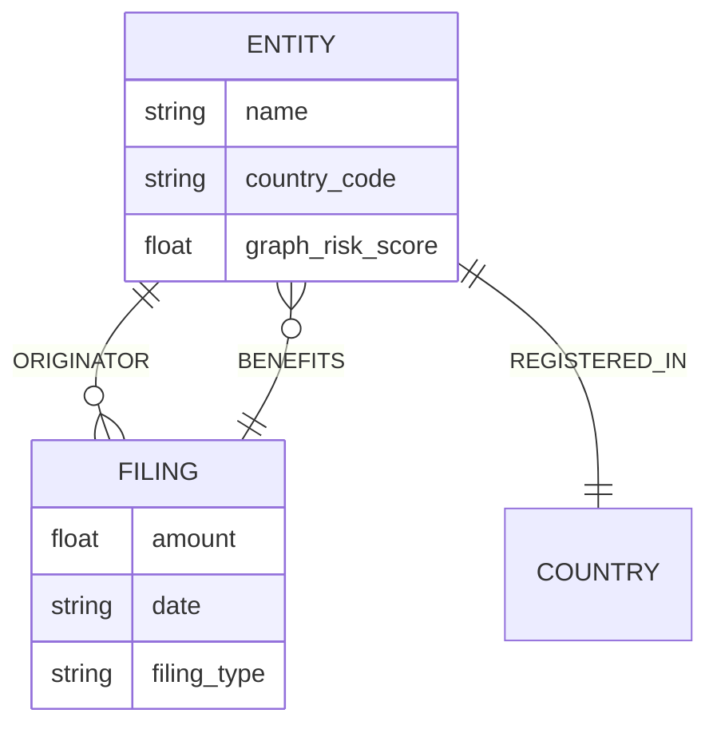

# AML AI Agent: FinCEN Graph Explorer

A high-performance Anti-Money Laundering (AML) investigation tool that leverages an AI Agent to translate natural language questions into complex Cypher queries executed against a Neo4j graph database containing the ICIJ FinCEN Files.

## 🏗️ System Architecture



## 📊 Data Model

The project utilizes the bipartite graph structure found in the FinCEN leak, mapped for optimal AI traversal.



## 🚀 Getting Started

### Prerequisites

- Docker Desktop or Rancher Desktop (4GB+ RAM allocated)
- Ollama (Running llama3 or mistral)
- Python 3.10+

### Installation & Setup

#### 1. Clone the repository

```bash
git clone https://github.com/yourusername/aml-ai-agent.git
cd aml-ai-agent
```

#### 2. Start the Neo4j database with Docker Compose

Create `docker-compose.yml`:

```yaml
services:
  neo4j:
    image: neo4j:5.26
    container_name: aml-neo4j
    ports:
      - "7474:7474" # Neo4j Browser (HTTP)
      - "7687:7687" # Bolt Protocol (Python Driver)
    volumes:
      - ./data:/data
      - ./import:/import
      - ./logs:/logs
    environment:
      - NEO4J_AUTH=neo4j/password123
      - NEO4J_PLUGINS=["apoc"] # Required for advanced graph algorithms
      - NEO4J_dbms_memory_heap_max__size=2G
      - NEO4J_dbms_memory_pagecache_size=1G
    restart: unless-stopped
```

Then start the container:

```bash
docker-compose up -d
```

#### 3. Load the FinCEN dataset

Place `fincen-50.dump` in the `./import` folder, then load it:

```bash
docker exec -it aml-neo4j neo4j-admin database load neo4j --from-path=/import --overwrite-destination=true
docker-compose restart neo4j
```

#### 4. Configure the graph schema

Run this in the Neo4j Browser (http://localhost:7474):

```cypher
MATCH (e:Entity) SET e:Bank;
MATCH (e1:Entity)<-[:ORIGINATOR]-(f:Filing)-[:BENEFITS]->(e2:Entity)
MERGE (e1)-[r:SENT_TO]->(e2)
SET r.amount = toFloat(f.amount);
```

#### 5. Install Python dependencies & run

```bash
pip install -r requirements.txt
python main.py
```

### 📁 Project Structure

| Directory | Purpose |
|-----------|---------|
| `/import` | Source for .dump files and CSV exports |
| `/data` | Persistent graph storage (survives container restarts) |
| `/app` | Python Agent source code |

### 💡 Docker Performance Notes

- **APOC**: Required for advanced graph algorithms like finding the "most influential bank in the network"
- **PageCache**: 1GB RAM allocated to keeping the graph "map" in memory — the difference between 10 seconds and 10 milliseconds

## 🔍 Example Investigations

The agent is trained to handle complex multi-hop financial patterns:

- **Basic**: "Who are the top 5 entities by total transaction volume?"
- **Geopolitical**: "Show the total money flow from NLD to RUS."
- **Suspicious Activity**: "Find banks that sent money back to themselves through a third party (circular flow)."

## 🛠️ Tech Stack

- **LLM**: Ollama (Local Llama 3)
- **Graph DB**: Neo4j 5.26
- **Language**: Python
- **Containerization**: Docker Compose
- **Visualization**: Mermaid.js
```
